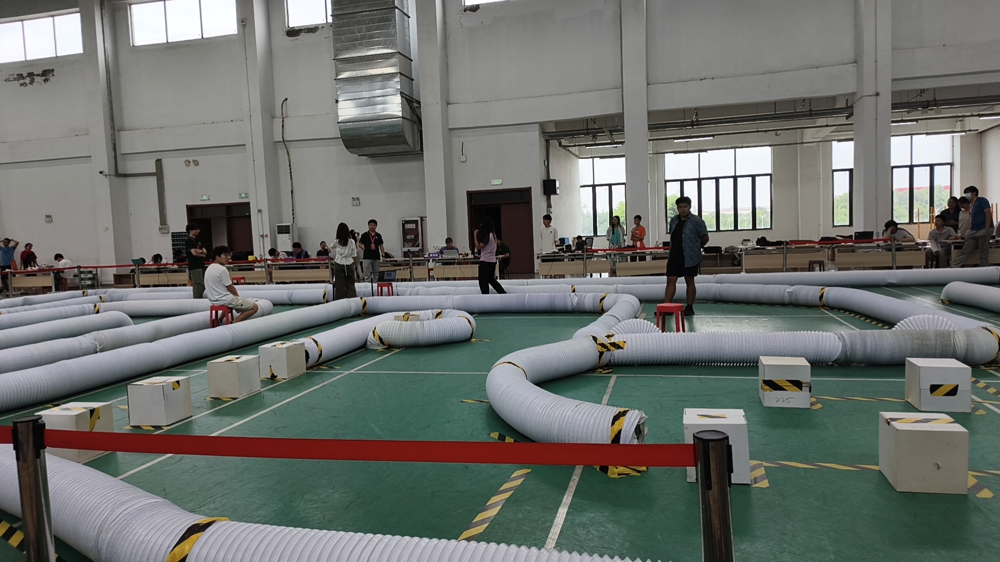
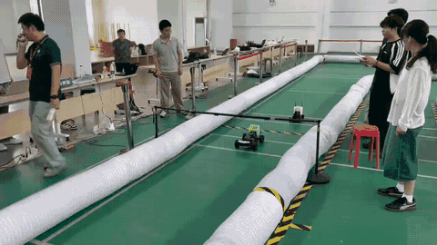
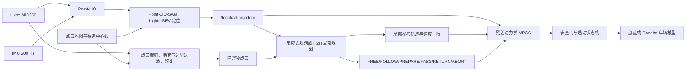

# Roboracer China 2026 — RoboRacer 4.0 m/s 完整栈

[English summary](#english-summary) · [实车运行](#实车运行) · [Gazebo 仿真](#gazebo-仿真) · [话题接口](#主要-ros-接口)

## RoboRacer China 2026 第二名方案

本方案面向 RoboRacer China 2026 赛道，核心 features 如下：

1. **改进的 Point-LIO 定位链路**：将地图管理从单一静态点云改为由关键帧索引、关键帧位姿、局部子地图和世界坐标点云缓存组成的结构化数据，并维护可增量更新的局部 scan-to-map 匹配目标；在此基础上提供 scan-to-map 修正、LighterBEV 自动重定位，以及面向前端漂移和全局不一致的漂移重定位与恢复。
2. **MPCC + 车辆动力学建模**：基于车辆动力学模型进行模型预测控制，实现参考轨迹跟踪、速度约束和安全控制输出。
3. **残差动力学**：在标称车辆动力学模型上学习并部署残差模型，用于补偿轮胎、执行器和其他未建模动力学误差。
4. **反应式避障或 H2H 超车避障**：支持无超车场景下的反应式避障，以及带对手车的 H2H 状态机、候选轨迹生成和超车避障。

本仓库公开 TianRacer/F1TENTH RoboRacer 的完整比赛代码，包括定位、MID360
感知、赛道约束、局部规划、超车状态机、残差动力学 MPCC、车辆接口、地图、
真实赛道 Gazebo world，以及实车和仿真的独立入口。

当前发布固定最高速度为 **4.0 m/s**，并提供三个版本：

| 编号 | 方案 | 实车入口 | 仿真入口 |
| --- | --- | --- | --- |
| 01 | RoboRacer，无超车 | `real_car/01_roboracer_4mps_no_overtake.sh` | `simulation/01_roboracer_4mps_no_overtake_sim.sh` |
| 02 | RoboRacer，反应式避障 + 绿色感知走廊 | `real_car/02_roboracer_4mps_reactive_green.sh` | `simulation/02_roboracer_4mps_reactive_green_sim.sh` |
| 03 | H2H 超车 + 绿色感知走廊 | `real_car/03_roboracer_4mps_h2h_green.sh` | `simulation/03_roboracer_4mps_h2h_green_sim.sh` |

> **安全提示**：实车脚本会连接底盘并产生真实转向和速度指令。首次运行必须架空
> 驱动轮、确认急停可用，并先执行 `--check-only`。仿真入口强制使用本机 ROS
> Master 且设置 `allow_real_hardware=false`，不会写入真实底盘命令接口。

## 实车赛道环境

Roboracer China 2026 在室内赛道环境中运行，赛道由软质围挡、障碍物和多段弯道组成：



## 实车运行视频

下面的 GIF 展示 RoboRacer China 2026 方案在赛道环境中的运行过程：



## 分支

| 分支 | 用途 |
| --- | --- |
| `real-car-original` | 实车算法快照和三个实车入口；不包含仿真兼容性修改 |
| `gazebo-simulation` | 默认开发分支；包含 Gazebo 11、真实赛道模型、MID360 插件以及全部算法源码 |

两个发布分支只保留各自的三个运行入口：实车入口位于
`real-car-original`，仿真入口位于 `gazebo-simulation`。上方对照表描述整个
仓库的六个入口，路径需在对应分支中使用。

克隆仿真分支：

```bash
git clone --branch gazebo-simulation \
  https://github.com/npu-ius-lab/Roboracer_China_2026.git
cd Roboracer_China_2026
```

克隆实车原始分支：

```bash
git clone --branch real-car-original \
  https://github.com/npu-ius-lab/Roboracer_China_2026.git Roboracer_China_2026_real
```

## 系统架构



算法链路包含：

- Point-LIO 前端、Point-LIO-SAM/LighterBEV 地图定位和重定位；
- MID360 原始点云的车体坐标转换、姿态水平化、绿色赛道走廊过滤与障碍物聚类；
- 无超车全局赛线、反应式避障，以及 H2H 左右候选轨迹与状态机；
- 基于 acados 的动态 MPCC、残差动力学模型、延迟补偿、启动保护和命令安全门；
- TianRacer 底盘接口、车辆描述、赛道数据、RViz 配置和运行记录工具。

## 环境要求

已验证环境：

- Ubuntu 20.04 x86_64；
- ROS Noetic；
- Gazebo Classic 11；
- GCC/G++ 9、CMake、catkin；
- Eigen3、PCL、yaml-cpp；
- acados `0.5.5`；
- CPU 版 C++11 ABI LibTorch `2.4.1`。

建议先安装 ROS 和常用依赖：

```bash
sudo apt update
sudo apt install ros-noetic-desktop-full python3-rosdep python3-catkin-tools \
  libeigen3-dev libpcl-dev libyaml-cpp-dev libopencv-dev \
  libgazebo11-dev unzip curl
sudo rosdep init 2>/dev/null || true
rosdep update
```

acados 必须以共享库方式构建，并通过 `ACADOS_SOURCE_DIR` 指向安装目录：

```bash
export ACADOS_SOURCE_DIR="$HOME/opt/acados-0.5.5"
```

目录中应至少存在：

```text
$ACADOS_SOURCE_DIR/lib/libacados.so
$ACADOS_SOURCE_DIR/interfaces/acados_template
```

## 编译完整代码

安装仓库外的大型 LibTorch 依赖，然后按依赖顺序编译工作空间：

```bash
./tools/install_libtorch_cpu.sh
export ACADOS_SOURCE_DIR="$HOME/opt/acados-0.5.5"
./build_all.sh
```

`build_all.sh` 依次编译：

1. `dependencies_ws`：仓库内 ROS 消息依赖；
2. `localization`：Point-LIO 和 Point-LIO-SAM/LighterBEV；
3. `residual`：残差动力学；
4. `perception`：MID360 障碍物感知；
5. `controller`：MPCC、规划与状态机；
6. `simulation_ws`（仅仿真分支）：Gazebo、车辆桥和 Livox 仿真插件。

构建产物位于各工作空间的 `build/`、`devel/`，不会提交到 Git。

## Gazebo 仿真

### 运行三个版本

桌面环境默认打开 Gazebo GUI：

```bash
./simulation/01_roboracer_4mps_no_overtake_sim.sh
./simulation/02_roboracer_4mps_reactive_green_sim.sh
./simulation/03_roboracer_4mps_h2h_green_sim.sh
```

无界面运行示例：

```bash
GAZEBO_GUI=false \
  ./simulation/03_roboracer_4mps_h2h_green_sim.sh rviz:=false
```

降低 MID360 仿真负载：

```bash
./simulation/03_roboracer_4mps_h2h_green_sim.sh mid360_downsample:=4
```

`mid360_downsample` 配置：

| 值 | 每帧约射线数 | 用途 |
| ---: | ---: | --- |
| `2` | 12,000 | 高密度离线验证 |
| `3` | 8,000 | 默认实时配置 |
| `4` | 6,000 | 较低算力设备 |

### 赛道 world

三个 world 均使用
`simulation_ws/src/roboracer_gazebo/models/point_lio_competition_track/`
中的真实赛道模型。该模型由 Roboracer China 2025 Point-LIO 赛道源文件导出，
包含 Blend 源文件、墙体 OBJ、俯视预览、PGM/YAML 地图和 GPLv3 来源说明。

- `competition_track_clear.world`：无障碍赛道；
- `competition_track_reactive.world`：加入静态车辆尺寸障碍物；
- `competition_track_h2h.world`：加入沿同一赛线运动的对手车。

模型与控制器 raceline 使用相同的 `map` 坐标系，没有额外旋转、缩放或平移。

### 车辆和 MID360

Gazebo 车辆保持实车配置：

- 轴距 `0.320 m`；
- 车宽 `0.240 m`；
- 轮胎半径 `0.032 m`；
- 质量和转动惯量来自 RoboRacer 配置；
- 速度上限 `4.0 m/s`；
- 使用实车辨识得到的转向与速度执行器时间常数。

MID360 插件使用官方非重复扫描表，水平视场 360°、垂直视场约 59°、10 Hz
点云和 200 Hz IMU，同时发布 Livox `CustomMsg` 和车体坐标 `PointCloud2`。

仿真控制为了可重复回归使用 `/localization/vehicle_odom` 作为控制真值；Point-LIO
仍完整运行并发布 `/aft_mapped_to_init`，可与
`/localization/ground_truth_odom` 对比定位误差。实车分支使用完整地图定位链路。

### TF 链

RViz 的 Fixed Frame 使用 `map`。障碍物点云显示依赖：

```text
map → localization_base_link → body → raw_body_leveled
```

仿真启动文件会自动发布缺失的静态车体连接。H2H 的 `valid_area` 本身位于
`map`，感知点云位于 `raw_body_leveled`。

### 实时因子

Gazebo world 的目标实时因子是 `1.0`，实际值取决于 CPU、GUI 和 MID360
射线数量：

```bash
gz stats
```

规划器在仿真中使用 `/clock` 判断点云与里程计新鲜度，因此实时因子低于 1.0
不会再错误触发 `planner health=false`。实车仍使用墙上时间的 fail-closed
看门狗。

## 实车运行

切换或单独克隆 `real-car-original` 后编译：

```bash
git switch real-car-original
./tools/install_libtorch_cpu.sh
export ACADOS_SOURCE_DIR="$HOME/opt/acados-0.5.5"
./build_all.sh
```

先执行只检查模式：

```bash
./real_car/01_roboracer_4mps_no_overtake.sh --check-only
./real_car/02_roboracer_4mps_reactive_green.sh --check-only
./real_car/03_roboracer_4mps_h2h_green.sh --check-only
```

通过检查、架空驱动轮并确认急停后，才能按车端部署流程启动对应脚本。仓库不保存
车辆 IP、用户名、密码、SSH 私钥或 ROS Master 地址；这些信息必须通过本机环境和
部署配置提供。

三个发布入口都将速度上限固定为 4.0 m/s。车辆动力学参数文件未因仿真而修改，
仿真适配只存在于 `gazebo-simulation` 分支。

## 主要 ROS 接口

### 通用定位与传感器

| 话题 | 类型 | 说明 |
| --- | --- | --- |
| `/livox/lidar` | `livox_ros_driver/CustomMsg` | MID360 原始点 |
| `/livox/imu` | `sensor_msgs/Imu` | MID360 IMU |
| `/cloud_registered_body` | `sensor_msgs/PointCloud2` | 车体坐标点云 |
| `/aft_mapped_to_init` | `nav_msgs/Odometry` | Point-LIO 里程计 |
| `/localization/odom` | `nav_msgs/Odometry` | 规划器定位输入 |
| `/localization/vehicle_odom` | `nav_msgs/Odometry` | MPCC 车辆中心状态 |

### 感知

| 话题 | 类型 | 说明 |
| --- | --- | --- |
| `/raw_cloud_perception/roi_cloud` | `sensor_msgs/PointCloud2` | 绿色赛道走廊内 ROI |
| `/raw_cloud_perception/obstacle_cloud` | `sensor_msgs/PointCloud2` | 聚类后的障碍物点云 |
| `/raw_cloud_perception/corridor_markers` | `visualization_msgs/MarkerArray` | 绿色走廊可视化 |

### H2H

| 话题 | 类型 | 说明 |
| --- | --- | --- |
| `/roboracer_h2h_faststart/health` | `std_msgs/Bool` | 规划器健康状态 |
| `/roboracer_h2h_faststart/state` | `std_msgs/String` | H2H 状态机 |
| `/roboracer_h2h_faststart/status` | `std_msgs/String` | JSON 状态和输入诊断 |
| `/roboracer_h2h_faststart/candidate_left` | `nav_msgs/Path` | 左侧候选轨迹 |
| `/roboracer_h2h_faststart/candidate_right` | `nav_msgs/Path` | 右侧候选轨迹 |
| `/roboracer_h2h_faststart/selected_path` | `nav_msgs/Path` | 选中轨迹 |
| `/roboracer_h2h_faststart/valid_area` | `geometry_msgs/PolygonStamped` | 车辆中心可安全行驶区域 |
| `/roboracer_h2h_faststart/local_speed_cap` | `std_msgs/Float32` | 局部速度上限 |

`valid_area` 已考虑半车宽和边界安全余量，它表示车辆中心允许进入的区域，不是
物理赛道边界，也不是最终轨迹。

## 运行检查

仿真启动后执行：

```bash
source simulation/common.bash
rosrun roboracer_gazebo simulation_healthcheck.py
```

H2H 详细检查：

```bash
rostopic echo -n 1 /roboracer_h2h_faststart/status
rostopic echo /roboracer_h2h_faststart/health
rosrun tf tf_echo map raw_body_leveled
```

正常状态应包含：

```text
"healthy": true
"input_error": "none"
"input_time_basis": "simulation"   # Gazebo
```

## 已完成的本机验收

- 完整源码编译通过，包括 Point-LIO、LighterBEV、感知、控制和 Gazebo 插件；
- MID360 Livox 消息和车体点云均达到 10 Hz 仿真频率，IMU 为 200 Hz；
- 无超车版本完成整圈，最高速度约 4.0 m/s；
- 反应式版本执行过 `GLOBAL/FOLLOW/PASS/ABORT` 恢复并完成整圈；
- H2H 版本执行过 `FREE → FOLLOW → PREPARE → PASS` 并完成整圈；
- `map → raw_body_leveled` TF 已在运行中验证；
- 人为限制实时因子为 `0.125` 时，15 秒内规划器发布 47 次 `health=true`、
  0 次 `health=false`，车辆继续运动。

上述结果是开发机回归记录，不代表在不同硬件、轮胎、地面或 Gazebo 物理参数下
可以跳过重新标定和安全测试。

## 常见问题

### `rostopic list` 没有话题

确认仿真终端仍在运行，并检查：

```bash
echo "$ROS_MASTER_URI"
rosnode list
```

仿真脚本使用 `http://127.0.0.1:11311`。不要在另一个终端保留指向实车的
`ROS_MASTER_URI`。

### RViz 报 `map` 与 `raw_body_leveled` 不在同一 TF 树

必须用最新 `gazebo-simulation` 分支重新启动完整仿真，而不是只启动 RViz。检查：

```bash
rosrun tf tf_echo map raw_body_leveled
```

### `V5 JUBU fail-closed: planner health=false`

启动初期第一帧有效点云到达前允许短暂出现。若持续出现，读取：

```bash
rostopic echo -n 1 /roboracer_h2h_faststart/status
```

重点检查 `input_error`、`roi_cloud_age_s` 和 `odom_age_s`。低实时因子造成的墙上
时间误判已修复；真实的点云或里程计中断仍会按 fail-closed 逻辑停车。

## 目录结构

```text
controller/       动态 MPCC、残差模型接口、规划、状态机、赛线和 RViz
residual/         学习残差动力学模型及推理代码
localization/     Point-LIO、Point-LIO-SAM、LighterBEV、地图定位
perception/       MID360 原始点云障碍物感知
vehicle/          TianRacer 底盘、描述、Livox ROS 驱动和支持包
third_party/      随仓库构建的 ROS 消息依赖
real_car/         三个实车入口
simulation/       三个仿真入口和统一环境
simulation_ws/    Gazebo world、真实赛道模型、MID360 插件和车辆桥
tools/            外部依赖安装工具
```

## 许可证与来源

本仓库是多来源代码集合，各目录和第三方组件保留各自的许可证及版权声明。特别是
TianRacer 相关代码和真实赛道派生模型包含 GPLv3 代码/素材；Livox Gazebo 插件、
Point-LIO、Livox ROS Driver、Nano-GICP、Patchwork++、IKFoM、ikd-tree、
Ackermann 消息、RapidJSON 等分别沿用其上游许可证。

仓库顶层说明不会覆盖子组件许可证。再发布、修改或用于产品前，请检查对应目录的
`LICENSE`、`package.xml` 和 `SOURCE.md`。来源和公开审计详见
[OPEN_SOURCE_AUDIT.md](OPEN_SOURCE_AUDIT.md)。

## English summary

This repository contains the complete ROS Noetic RoboRacer 4.0 m/s racing
stack: Point-LIO/localization, MID360 perception, reactive avoidance, H2H
overtaking and state machine, residual-dynamics MPCC, TianRacer interfaces,
track data, and a Gazebo 11 simulation built from the real Point-LIO track.

Use `gazebo-simulation` for local simulation and `real-car-original` for the
hardware snapshot. Three matching launch scripts are provided on each branch.
Hardware launchers can command a real vehicle; always run `--check-only` and
verify the emergency stop before deployment.
